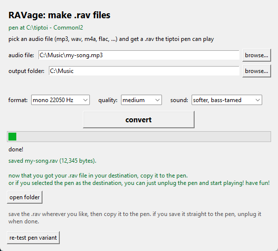

# RAVage: tiptoi `.rav` audio converter

**English** · [Deutsch](README.de.md)

[](https://github.com/Markthegamer108/RAVage/releases/tag/v0.1.2)

Turns any audio file (mp3, wav, m4a, flac, whatever) into a `.rav` file your
Ravensburger tiptoi pen (3203L) will actually play. It also decrypts stock
`.rav` files back to ogg, because why not.

The whole RAV "encryption" was reverse engineered from the pen's firmware
update (`Update3203L.upd`) with a disassembler and a lot of staring.
Everything is implemented from scratch and checked byte-for-byte against
original pen files. Far as we can tell, this is the first working
implementation. The community wrote the format off as "serious crypto" about
ten years ago ([issue #115](https://github.com/entropia/tip-toi-reveng/issues/115)).



## Ready-made builds

No Python needed. Grab the right one for your OS from the
[releases page](https://github.com/Markthegamer108/RAVage/releases) (or the
artifacts of the last workflow run):

| OS | What you get | Notes |
|----|--------------|-------|
| Windows x86_64 | `ravage-windows.zip` with `ravage.exe` + `ravage-cli.exe` | double-click `ravage.exe` |
| macOS (Apple Silicon) | `ravage-macos-arm64.dmg` with `ravage.app` + `ravage-cli` | unsigned, right-click → Open |
| macOS (Intel) | `ravage-macos-x86_64.dmg` with `ravage.app` + `ravage-cli` | same, for older Macs |
| Linux x86_64 | `ravage-linux-x86_64.tar.gz` with `ravage` + `ravage-cli` | `chmod +x` if needed |
| Linux ARM64 | `ravage-linux-arm64.tar.gz` with `ravage` + `ravage-cli` | Raspberry Pi 4/5, Rock64, etc. |
| Linux ARM32 | `ravage-linux-armhf.tar.gz` with `ravage` + `ravage-cli` | Raspberry Pi 1/2/3/Zero (32-bit OS) |

Everything's bundled: ffmpeg, key table, the lot. Builds happen automatically
on GitHub Actions (`.github/workflows/build.yml`).

### Tested hardware

Verified on a real pen: **tiptoi gen 2 (3203L)** with `key8 = CommonI2`. Newer pens use the same
RAV file family, but their firmware differs — one user reported `CommonID`
instead of `CommonI2`. The key table comes from each pen's own firmware
(`data/keytable.bin` is from `Update3203L.upd`), so if you have a gen 3 pen,
test it against its own stock files first. The decryptor makes that easy:

```
python rav_cli.py decrypt "Old MacDonald Had a Farm.rav"   # prints key8
python rav_cli.py convert "My Song.mp3" -o "My Song.rav" --key8 CommonID
# GUI: change the "pen key" field from CommonI2 to CommonID
```

## Quick start

### GUI (the easy way)

```bat
run_gui.bat
```

or

```
python rav_gui.py
```

Pick an audio file, pick an output folder, hit **Convert to .rav**, then
copy the result to the pen's music folder (e.g. `E:\songs\My Song.rav`).

### CLI

```
python rav_cli.py convert "My Song.mp3" -o "My Song.rav"
python rav_cli.py convert "My Song.mp3" -o "My Song.rav" --key8 CommonID   # if your pen uses CommonID
python rav_cli.py decrypt "Old MacDonald Had a Farm.rav" -o song.ogg        # research, prints key8
```

## How it works

A `.rav` file is a 0x20-byte header, then an **Ogg Vorbis** audio stream
(mono, 22050 Hz) run through a simple keyed byte transform. The pen ignores
Ogg page CRCs, so the ciphertext doesn't need valid CRCs.

### Header (20 bytes)

| Offset | Size | Meaning |
|-------:|-----:|---------|
| 0x00 | 16 | magic `Ravensburgerv03\0` |
| 0x10 | 2  | `value16` (little-endian) |
| 0x12 | 1  | flag, always `0xBE` |
| 0x13 | 8  | key blob: `TABLE[value16 + 3 + i] ^ key8[i]` |
| 0x1B | 5  | trailer, fixed `4E 6C 31 F2 65` |

### Key derivation

```
key8     = "CommonI2"  # default; some pens use "CommonID"
checksum = (sum(key8) + value16) & 0xFFFF          # e.g. 0x78 → 0x035C (CommonI2) / 0x035E (CommonID)
keystream[i] = TABLE[(checksum + i) & 0xFFF]        # 512 bytes
```

The 4096-byte `TABLE` is a fixed key table in the firmware (file offset
`0xDBADC`, memory `0x008EDADC`), bundled here as `data/keytable.bin`.

### Body cipher

Applied to the payload starting at file offset `0x20`:

```
kb = keystream[(pos - 0x20) & 0x1FF]
op = pos & 3

op 0  XOR with pass-through:  if c ∈ {0x00, 0xFF, kb} or (c ^ kb) == 0xFF
                              → keep c unchanged, else out = c ^ kb
op 1  out = (c - kb) & 0xFF
op 2  out = (c + kb) & 0xFF
op 3  out = c ^ kb            (no pass-through rules)
```

The pass-through rules (verified in the firmware loop at `0x8DF3B4`) make
sure a byte collision with the keystream never produces a value that
confuses the decoder. The encoder mirrors them exactly (`op 0`: if the
plaintext is `0x00`, `0xFF`, `kb`, or `kb ^ 0xFF`, emit it unchanged), so
encryption is **lossless**. Official pen files are actually lossy at those
spots; ours round-trip byte-exact.

> **Metadata matters.** The pen rejects streams whose Vorbis comment header
> is too big. YouTube rips carry a huge embedded synopsis, and a ~9 KB
> header fails. ~3.6 KB works, which is also what stock files use. The
> converter strips all metadata (`-map_metadata -1`).

> **Sound shaping.** By default the converter applies a gentle "tamed"
> chain: high-pass at 70 Hz (the pen's tiny speaker can't do sub-bass and it
> just muddies things), −4 dB gain, and a −1 dB peak limiter. The GUI offers
> "Much softer" (−8 dB) and "Original loudness" (no processing); the CLI has
> `--gain-db` and `--no-tame`.

## How it was cracked

Short version for people who enjoy the chase. No side channels, no leaked
keys. It was all sitting in plain sight.

1. **The rabbit hole.** The wiki and issue #115 (closed 2015) declared RAV
   files encrypted with "serious crypto" and floated the idea that the key
   might live on a per-pen chip. Nobody broke it for ~10 years.

2. **The firmware.** Ravensburger publishes the pen's firmware update
   (`Update3203L.upd`) right on their website. It's a plain Cortex-M (ARM
   Thumb-2) image, no obfuscation worth the name.

3. **Find the audio path.** Search the image for the RAV magic
   `Ravensburgerv03` → lands on the audio open function at `0x8DFE84`, which
   calls a key generator (`0x8DF380`) and the decode loop (`0x8DF3B4`).

4. **The "secret" was public.** The key generator builds a 512-byte
   keystream from `key8 = "CommonI2"` (a hardcoded string literal in the
   firmware) plus a 4096-byte table sitting in the image at `0xDBADC`. Every
   pen ships with its decryption key baked in. There was never a per-pen
   secret. It's not cryptography, it's a fancy XOR with a lookup table.

5. **Verify, fail, fix.** First attempts round-tripped perfectly on the PC
   but the pen refused to play our files. The keystream index is
   payload-relative (`pos - 0x20`), while the op selector is absolute
   (`pos & 3`). Getting the phase wrong silently shifted the whole stream.
   That little detail cost a couple of days.

6. **The quirks.** The pen ignores Ogg page CRCs (sloppy decoder, lucky for
   us) and rejects streams with fat Vorbis comment headers. A ~9 KB
   YouTube-rip header fails; the ~3.6 KB stock size works.

7. **Real hardware.** Old MacDonald. Olchi. Drei Chinesen. All decrypted to
   `OggS`; custom files play on the pen. Done.

## Reverse engineering notes

- Firmware: `Update3203L.upd` (Cortex-M, ARM Thumb-2). File offset → memory
  `+ 0x00812000`.
- Audio open function: `0x8DFE84`. Key generator: `0x8DF380`
  (`KEY[i] = TABLE[(checksum + i) & 0xFFF]`, note the mask applies to
  `checksum + i` only). Body cipher loop: `0x8DF3B4`.
- `0x8DF2FC` / `0x8DF340` are init/cleanup only, not key derivation.
- Stock files decrypt with `key8 = b"CommonI2"` (or `b"CommonID"` on some pens)
  and `value16 = 0x78` on all factory files; payloads are all Ogg Vorbis (mono 22050 Hz).

### Regenerating `data/keytable.bin`

```python
from rav_tool import ravcrypto
ravcrypto.extract_keytable(r"C:\path\to\Update3203L (1).upd", "data/keytable.bin")
```

## Dependencies

- Python 3.8+
- `ffmpeg` on PATH **or** `pip install imageio-ffmpeg` (bundled static build)
- `numpy` (optional. There's a pure-Python fallback, it's just ~10× slower)

## Files

```
rav_gui.py / rav_gui.pyw   GUI converter (double-click friendly)
rav_cli.py                 command-line converter + decryptor
rav_tool/ravcrypto.py      the RAV cipher, header build/parse, key table
rav_tool/convert.py        ffmpeg wrapper (any format → Ogg Vorbis)
data/keytable.bin          key table extracted from firmware 3203L
```

## License

MIT. Free to use, study, and share.

## Community

Built on the groundwork of the
[tip-toi-reveng](https://github.com/entropia/tip-toi-reveng) community and
their [wiki](https://github.com/entropia/tip-toi-reveng/wiki). The RAV
format was the last big unsolved piece, so if you're into this stuff, join
the [tiptoi mailing list](https://lists.nomeata.de/mailman/listinfo/tiptoi)
and say hi.
